# Business Website Skill

> **Business Website Builder Skill for AI Agents**  
> An open-source Agent Skill that helps AI agents create client-ready corporate, brand, B2B, service, and proposal-grade websites from source materials, existing sites, PPT/PDF files, images, briefs, and reference websites.
>
> Created and maintained by **月瑀科技 YUEYU TECH**. Published by **ChuluuMGL**.

[中文说明](README.zh-CN.md) | English

[](./SKILL.md)
[](./skill.json)
[](./LICENSE)
[](https://www.yueyu.tech/)
[](./assets/templates/static-business-site/)
[](./SKILL.md)

---

## What This Skill Does

`business-website-skill` turns messy website inputs into a structured, evidence-safe website production workflow.

| Output | What It Contains |
|---|---|
| Evidence map | Confirmed facts, missing facts, forbidden assumptions, and usable asset inventory. |
| Site blueprint | Sitemap, homepage section outline, CTA path, proof modules, and case/scenario taxonomy. |
| Design direction options | 2-3 visual routes when brand direction is unclear. |
| Website implementation | Static HTML/CSS/JS, React/Vite, Next.js, or existing-stack edits depending on the project. |
| SEO/GEO readiness | Titles, descriptions, canonical assumptions, social metadata, JSON-LD candidates, crawlability, and source-backed summary modules. |
| QA report | Broken asset checks, anchor checks, responsive/mobile review guidance, source-integrity checks, and handoff notes. |

The purpose is not to create a generic landing page. The purpose is to help a client quickly understand: who this company is, what it does, why it is credible, and how to take the next step.

---

## Use Cases

| Scenario | Typical Request |
|---|---|
| Corporate website | "Build a company website from this PDF and brand folder." |
| B2B service website | "Create a B2B service site with capabilities, cases, and contact CTA." |
| Brand website | "Turn this brand deck into a polished public-facing website." |
| Proposal-grade landing page | "Create a client presentation page for this pitch or招商 project." |
| Project showcase | "Build a showcase page for this industrial/technology/project case." |
| Existing website polish | "Audit and improve this static website before client delivery." |
| Website IA planning | "Give me the sitemap, page outline, and design direction options first." |
| Cross-agent workflow reuse | "Install this skill in Cursor, Claude Code, Trae, OpenClaw, Hermes, or Codex." |

---

## Workflow

This skill uses a stage-gated workflow inspired by professional website strategy and proposal production.

| Phase | Gate | Deliverable |
|---|---|---|
| 0. Intake | Choose site type, stack, visual direction, and delivery mode. | Assumptions and user choices |
| 1. Evidence map | Separate confirmed facts from unknowns and forbidden assumptions. | Source-backed evidence map |
| 2. Site blueprint | Build sitemap, homepage outline, proof modules, and CTA path. | Blueprint for review |
| 3. Design direction | Offer 2-3 visual routes when the brand direction is unclear. | Direction options |
| 4. Implementation plan | Define files, components, assets, interactions, and checks. | Build plan |
| 5. Build | Implement with static files, React/Vite/Next, or the existing stack. | Website files |
| 6. QA | Check source integrity, assets, anchors, layout, mobile, forms, and handoff. | QA result |
| 7. Handoff | Summarize files, preview/run steps, validation, and remaining confirmations. | Delivery notes |

Default behavior is pragmatic: if the user wants speed, the agent proceeds with conservative assumptions and marks unknowns as `to be confirmed`; if the user wants control, the agent pauses after blueprint and design direction choices.

---

## Work Modes

| Mode | When to Use | Behavior |
|---|---|---|
| `guided` | You want to confirm strategy before code. | Produces evidence map, sitemap, section outline, and design directions first. |
| `auto` | You need a complete first draft quickly. | Makes conservative assumptions, marks unknowns, and implements. |
| `edit` | You already have a website. | Preserves the existing stack and visual system unless asked to redesign. |
| `audit` | You only want review feedback. | Returns findings, risks, and suggested revisions without rebuilding. |

---

## Website Routes

The skill does not force every site into the same template. It routes the project into one primary website type:

| Route | Best For |
|---|---|
| Corporate / enterprise website | Company overview, services, qualifications, news, contact. |
| B2B service website | Service scope, scenarios, proof, process, inquiry CTA. |
| Brand website | Brand story, positioning, product/service narrative, visual identity. |
| Proposal /招商 /投标 page | One-off presentation page, campaign proposal, investment or tender context. |
| Project showcase | Case detail, project background, solution, outcome, media assets. |
| Professional service website | Consulting, agency, production, operations, and expert service businesses. |

---

## Included Files

| File / Folder | Purpose |
|---|---|
| [`SKILL.md`](./SKILL.md) | Core skill metadata and agent instructions. |
| [`NOTICE`](./NOTICE) | Copyright, company, maintainer, and publication notice. |
| [`references/agent-experience.md`](./references/agent-experience.md) | Agent interaction modes, minimal questions, checkpoints, and handoff behavior. |
| [`references/delivery-standards.md`](./references/delivery-standards.md) | Layout, typography, color, image, interaction, responsive, and copy standards. |
| [`references/example-patterns.md`](./references/example-patterns.md) | Reusable patterns from static, React, and service-site examples. |
| [`references/benchmark-patterns.md`](./references/benchmark-patterns.md) | Business website benchmark patterns and maturity checks. |
| [`references/seo-geo-checklist.md`](./references/seo-geo-checklist.md) | SEO, GEO, AI-search readiness, structured-data, crawlability, and launch-indexing checks. |
| [`references/style-presets.md`](./references/style-presets.md) | Premium visual style presets for mainstream business website directions. |
| [`references/interaction-presets.md`](./references/interaction-presets.md) | Interaction and animation presets, including Anime.js guidance. |
| [`references/preview-guide.md`](./references/preview-guide.md) | Visual preview, overlap review, and motion-intensity evaluation guide. |
| [`references/qa-checklist.md`](./references/qa-checklist.md) | Final QA checklist and failure modes. |
| [`assets/presets/design-styles.json`](./assets/presets/design-styles.json) | Machine-readable style preset catalog. |
| [`assets/presets/interaction-presets.json`](./assets/presets/interaction-presets.json) | Machine-readable interaction preset catalog. |
| [`assets/previews/`](./assets/previews/) | Style preview images and interaction GIFs. |
| [`assets/templates/static-business-site/`](./assets/templates/static-business-site/) | Dependency-free static website starter template. |
| [`scripts/generate_preview_assets.py`](./scripts/generate_preview_assets.py) | Regenerates style preview images and interaction GIFs. |
| [`scripts/audit_static_site.py`](./scripts/audit_static_site.py) | Static site audit script using only Python standard library. |
| [`agents/openai.yaml`](./agents/openai.yaml) | Codex/OpenAI-style UI metadata. |
| [`skill.json`](./skill.json) | Machine-readable metadata for directories and marketplaces. |

The static template is a structure starter only. Replace all `待补充`, `待确认`, and sample placeholders with source-backed client facts before delivery.

---

## Install And Compatibility

The core skill follows the open Agent Skills shape: a folder with `SKILL.md`, plus optional `references/`, `scripts/`, and `assets/`. Most compatible agents only require the folder to be placed under their skills directory.

| Agent/runtime | Suggested install path | Status |
|---|---|---|
| Codex | `.agents/skills/business-website-skill/` or user skills folder | Supported |
| Claude Code | `.claude/skills/business-website-skill/` | Expected compatible |
| Cursor | `.cursor/skills/business-website-skill/` or project skills folder | Expected compatible |
| Trae | `.trae/skills/business-website-skill/` | Expected compatible |
| Antigravity | `.agent/skills/business-website-skill/` or configured skills folder | Expected compatible |
| OpenClaw | workspace or user skills root documented by OpenClaw | Expected compatible |
| Hermes | `~/.hermes/skills/business-website-skill/` or configured skills root | Expected compatible |

Only Codex-specific UI metadata lives in `agents/openai.yaml`. Other agents can ignore that file and use `SKILL.md` directly.

Compatibility status is conservative: only runtimes with completed end-to-end runs should be moved into `skill.json` `tested`. Claude Code diagnostic feedback has been incorporated, but a full Phase 0-7 runtime run should be recorded before marking it tested.

### Ask An AI Agent

You can ask a coding agent:

> Install the business-website-skill from https://github.com/ChuluuMGL/business-website-skill

### Generic Install

```bash
git clone https://github.com/ChuluuMGL/business-website-skill.git .agents/skills/business-website-skill
```

Or with SSH:

```bash
git clone git@github.com:ChuluuMGL/business-website-skill.git .agents/skills/business-website-skill
```

Then invoke by name where supported:

```text
$business-website-skill
```

### Agent-Specific Examples

```bash
# Claude Code
git clone https://github.com/ChuluuMGL/business-website-skill.git .claude/skills/business-website-skill

# Cursor
git clone https://github.com/ChuluuMGL/business-website-skill.git .cursor/skills/business-website-skill

# Trae
git clone https://github.com/ChuluuMGL/business-website-skill.git .trae/skills/business-website-skill

# Antigravity
git clone https://github.com/ChuluuMGL/business-website-skill.git .agent/skills/business-website-skill

# Hermes
git clone https://github.com/ChuluuMGL/business-website-skill.git ~/.hermes/skills/business-website-skill
```

OpenClaw and other runtimes may use configurable workspace or global skill roots. Place the cloned folder under the root they scan.

---

## Recommended Prompts

### Guided Blueprint First

```text
Use $business-website-skill to create a client-ready business website from the materials in this folder.

Do not implement yet. First return:
1. Evidence map
2. Sitemap
3. Homepage section outline
4. CTA path
5. 3 design direction options
6. Questions that need my confirmation
```

### Direct Static Prototype

```text
Use $business-website-skill to build a static B2B website prototype.

Requirements:
- use source-backed facts only
- mark missing information as to be confirmed
- start from the static-business-site template if useful
- include mobile navigation, CTA, proof cards, cases, process, and contact section
- run the static audit script before final handoff
```

### Existing Website Audit

```text
Use $business-website-skill to audit and polish this existing company website.

Goals:
- improve first-view clarity
- check evidence and unsupported claims
- fix responsive layout issues
- verify anchors, images, mobile menu, and form feedback
- return QA findings and implement safe fixes
```

### Premium Or Showcase Motion

```text
Use $business-website-skill to make this business website feel more premium and interactive.

Before implementation, give me:
1. standard / premium / showcase motion recommendation
2. suitable libraries such as Anime.js, GSAP, Lenis, Motion, or Three.js
3. performance and accessibility risks
4. the safest fallback if the motion is too heavy
```

---

## Design Principles

- Start from the buyer's decision problem, not from a generic service list.
- Make the first viewport explain value in 5 seconds.
- Separate confirmed facts from assumptions before writing copy.
- Use business evidence: cases, metrics, qualifications, process, team, certifications, reports, or implementation proof.
- Show one primary CTA and one secondary research CTA.
- Avoid fake customers, fake logos, fake awards, fake news, and fake form submission success.
- Make mobile layouts as credible as desktop layouts.
- Treat visual style as a business signal: B2B trust, technical clarity, premium brand, or content-led professionalism.

## SEO And GEO Readiness

This skill treats GEO as evidence-based SEO for AI-mediated discovery. It does not rely on hidden text, fake FAQs, unsupported schema, or special AI-only markup.

Public-launch checks include:

- crawlable first-party text for the main offer, audience, proof, process, and next step
- title, meta description, canonical URL, Open Graph, Twitter Card, and one primary `h1`
- JSON-LD that matches visible source-backed content
- clear internal links, sitemap/robots status, and no accidental `noindex`
- concise summary/FAQ/proof modules that answer real buyer questions

For static launch previews, run:

```bash
python3 scripts/audit_static_site.py assets/templates/static-business-site index.html --strict-seo
```

## Built-In Style And Interaction Presets

The skill includes preset guidance for mainstream premium business website directions:

| Preset Family | Best For |
|---|---|
| Executive B2B Trust | Consulting, professional services, enterprise suppliers. |
| Industrial Precision | Manufacturing, energy, engineering, environmental technology. |
| AI SaaS / Data Cloud | AI tools, SaaS platforms, analytics, automation. |
| Premium Editorial Brand | Brand studios, thought leadership, cultural or strategy sites. |
| Minimal Luxury | Premium products, founder brands, high-end services. |
| Dark Data Command Center | Dashboards, diagnostics, AI/ops products, data-heavy services. |
| Sustainable Green Tech | ESG, energy, environmental protection, climate technology. |
| Bold Creative Agency | Creative, production, marketing, campaign proposal sites. |
| Public Sector Civic | Public service, NGO, education, civic and institutional projects. |
| Fintech Secure | Finance, insurance, compliance, payment and B2B fintech sites. |

Interaction presets are split into motion tiers:

| Tier | Purpose |
|---|---|
| Standard | Safe, practical business motion for most corporate and B2B websites. |
| Premium | Polished product, brand, case-study, and SaaS interactions. |
| Showcase | More cinematic motion for AI, creative, campaign, and premium proposal pages. |
| Accessibility | Reduced-motion and fallback behavior that must accompany animated builds. |

Anime.js is treated as optional: use it when motion supports comprehension, not as decoration. GSAP/Lenis/Motion/Three.js are available for higher-intensity motion when the project has enough content, assets, and QA budget.

### Visual Preview

The deterministic preview sheet below is generated from the preset catalog and is useful for checking whether the directions are distinct and practical:

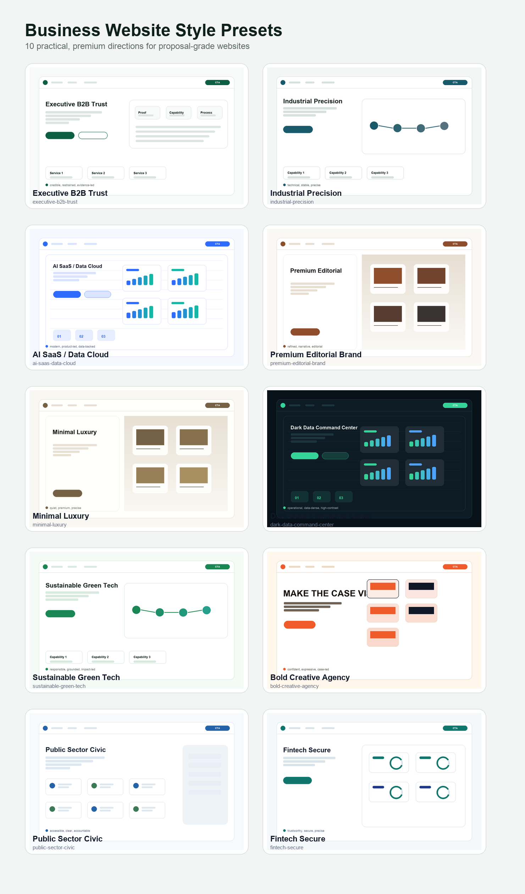

The AI concept moodboard is included only as a visual mood reference, not as a reusable template or factual website output:

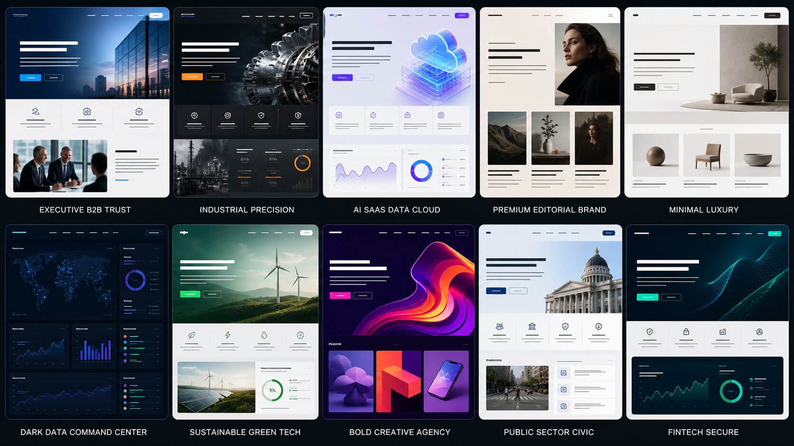

### Interaction GIF Preview

Representative standard/premium motion previews:

| Interaction | Preview |
|---|---|
| Anime.js staggered reveal | 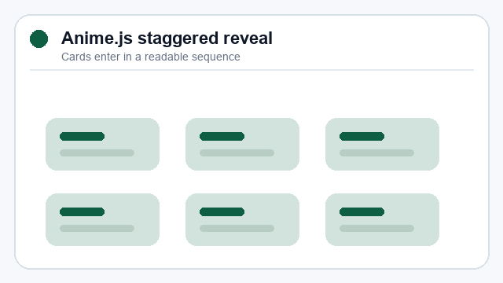 |
| Anime.js SVG line draw | 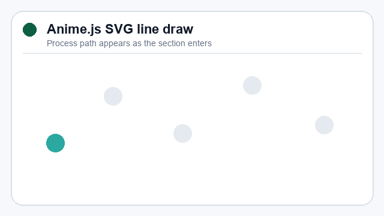 |
| Metric count-up | 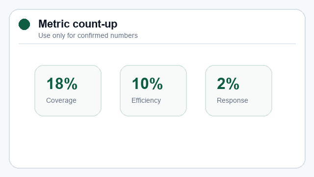 |
| Case filter transition | 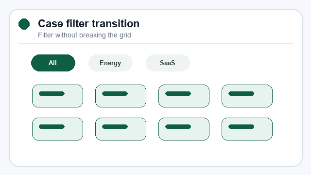 |
| Dashboard panel sequence | 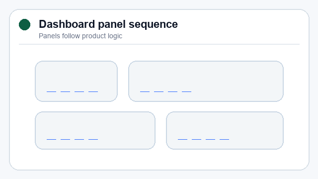 |
| Product hotspot tour | 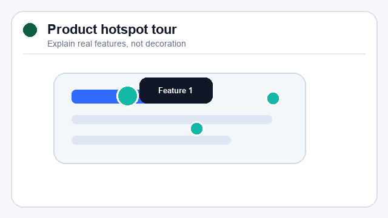 |

Showcase motion previews:

| Interaction | Preview |
|---|---|
| Pinned scroll storytelling | 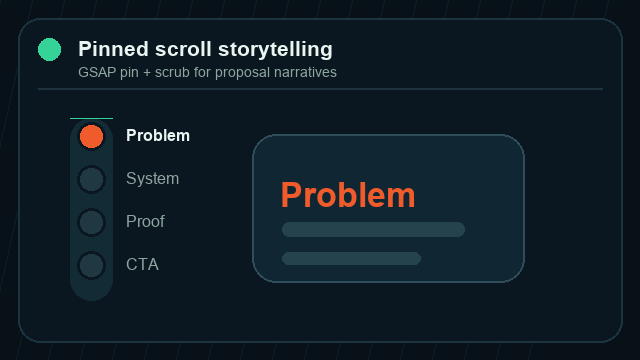 |
| Scroll-scrub dashboard morph | 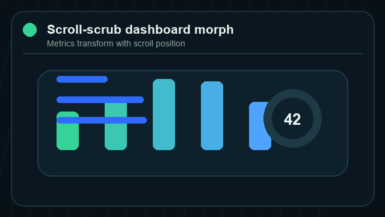 |
| Horizontal case wall | 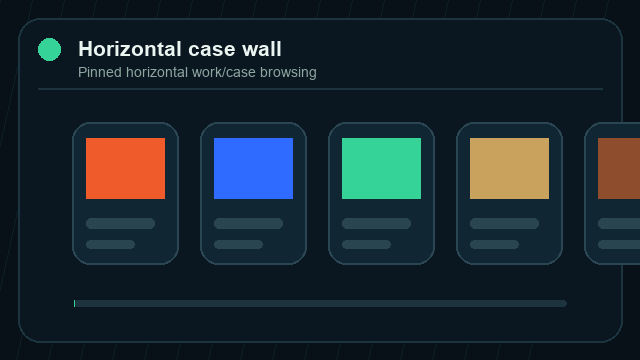 |
| Shared layout transition | 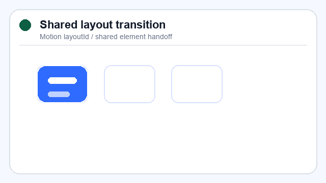 |
| Three.js product orbit hero | 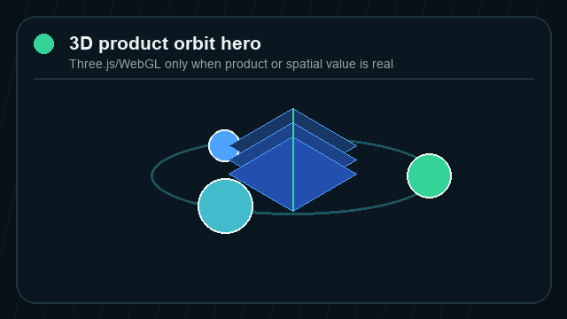 |
| Shader/liquid reveal | 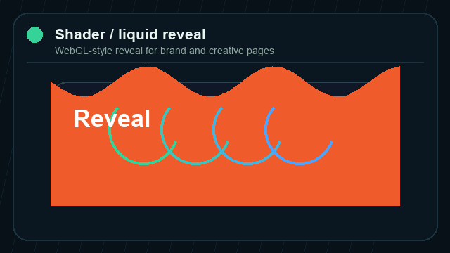 |
| Magnetic media hover | 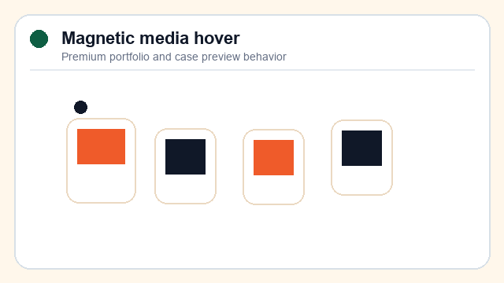 |
| Interactive orbit network | 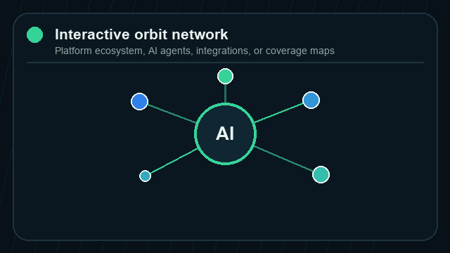 |

See [`assets/previews/interactions/`](./assets/previews/interactions/) for the full GIF set and [`references/preview-guide.md`](./references/preview-guide.md) for overlap and practicality notes.

To regenerate previews locally, install Pillow and run `python3 scripts/generate_preview_assets.py`.

### Preview Asset Policy

The PNG/JPG/GIF previews are human-facing documentation assets. Agents do not need to load them to use the skill; the executable workflow depends on `SKILL.md`, `references/`, `assets/presets/`, `assets/templates/`, and `scripts/`.

The repository currently keeps previews in git for a richer GitHub page. Moving existing binaries to GitHub Releases or Git LFS would require an explicit migration plan, and a true clone-size reduction would require history rewriting.

---

## Static Template

The included template is generic and safe for public use:

```text
assets/templates/static-business-site/
├── index.html
├── index.css
└── index.js
```

It uses placeholder copy such as `待补充` and `示例待确认`. Replace placeholders with source-backed client facts before delivery.

---

## Static Site Audit

Run:

```bash
python3 scripts/audit_static_site.py assets/templates/static-business-site index.html
```

For public static launches:

```bash
python3 scripts/audit_static_site.py assets/templates/static-business-site index.html --strict-seo
```

The script checks:

- local asset references
- hash anchors
- duplicate IDs
- viewport metadata
- image `alt` attributes
- CSS `url()` references
- title, meta description, `lang`, one `h1`, canonical, Open Graph, Twitter Card, robots warnings, and JSON-LD validity

---

## FAQ

**Is this an ecommerce website builder?**  
No. It is focused on corporate, brand, B2B, service, proposal,招商,投标, and project showcase websites. It does not implement shopping carts or payment checkout.

**Does it create websites automatically?**  
Yes, when used inside an agent that can edit files. It can create static prototypes or work inside React/Vite/Next/existing stacks.

**Does it require an MCP server?**  
No. This is a local skill package, not an MCP server.

**Can it use an existing website or brand assets?**  
Yes. Existing sites, brand folders, PPT/PDF files, images, and client visual identity take priority over the fallback static template.

**Will it invent customer cases or metrics?**  
No. The skill requires unknowns to be marked as `待补充`, `待确认`, or `示例待确认`.

**Can other agents use it?**  
Yes, if they support skill folders or can read `SKILL.md`-style packages. Installation paths differ by client.

---

## Technical Specs

| Item | Description |
|---|---|
| Skill name | `business-website-skill` |
| Repository | `ChuluuMGL/business-website-skill` |
| Format | Local skill folder with `SKILL.md`, references, scripts, assets, and metadata |
| Primary output | Website files plus evidence map, blueprint, QA, and handoff notes |
| Bundled asset | Static business website starter template |
| Script runtime | Static audit uses Python standard library; preview generation uses Pillow |
| License | MIT |
| Copyright holder | 月瑀科技 YUEYU TECH |
| Maintainer / GitHub publisher | ChuluuMGL |

## Directory Structure

```text
business-website-skill/
├── SKILL.md
├── README.md
├── README.zh-CN.md
├── LICENSE
├── NOTICE
├── skill.json
├── agents/
│   └── openai.yaml
├── references/
│   ├── agent-experience.md
│   ├── benchmark-patterns.md
│   ├── delivery-standards.md
│   ├── example-patterns.md
│   ├── interaction-presets.md
│   ├── preview-guide.md
│   ├── qa-checklist.md
│   ├── seo-geo-checklist.md
│   └── style-presets.md
├── assets/
│   ├── presets/
│   │   ├── design-styles.json
│   │   └── interaction-presets.json
│   ├── previews/
│   │   ├── style-overview.png
│   │   ├── ai-style-moodboard.jpg
│   │   ├── styles/
│   │   └── interactions/
│   └── templates/
│       └── static-business-site/
└── scripts/
    ├── generate_preview_assets.py
    └── audit_static_site.py
```

## Related Skills

- [proposal-ppt-skill](https://github.com/ChuluuMGL/proposal-ppt-skill) - Create stage-gated business proposal decks and presenter scripts.
- [yueyu-skill](https://github.com/ChuluuMGL/yueyu-skill) - Query YUEYU TECH company and marketing-service information.
- [dy-creative-skill](https://github.com/ChuluuMGL/dy-creative-skill) - Query related marketing services and lead capture workflows.

## License

MIT. Copyright (c) 2026 月瑀科技 YUEYU TECH.

## Ownership

| Item | Value |
|---|---|
| Copyright holder | 月瑀科技 YUEYU TECH |
| Maintainer / GitHub publisher | [ChuluuMGL](https://github.com/ChuluuMGL) |
| Company website | [www.yueyu.tech](https://www.yueyu.tech/) |
| Notice | [NOTICE](./NOTICE) |

---

<!-- Structured Data for SEO: JSON-LD -->
<!-- {
  "@context": "https://schema.org",
  "@type": "SoftwareApplication",
  "name": "business-website-skill",
  "alternateName": "Business Website Builder Skill",
  "description": "Open-source AI Agent Skill for building client-ready corporate, brand, B2B, service, and proposal-grade business websites from source materials.",
  "url": "https://github.com/ChuluuMGL/business-website-skill",
  "applicationCategory": "DeveloperApplication",
  "operatingSystem": "Any",
  "offers": {
    "@type": "Offer",
    "price": "0",
    "priceCurrency": "USD",
    "description": "The skill is open source under the MIT license."
  },
  "author": {
    "@type": "Organization",
    "name": "月瑀科技",
    "alternateName": "YUEYU TECH",
    "url": "https://www.yueyu.tech/"
  },
  "maintainer": {
    "@type": "Person",
    "name": "ChuluuMGL",
    "url": "https://github.com/ChuluuMGL"
  },
  "copyrightHolder": {
    "@type": "Organization",
    "name": "月瑀科技",
    "alternateName": "YUEYU TECH",
    "url": "https://www.yueyu.tech/"
  },
  "programmingModel": "Agent Skills / SKILL.md",
  "softwareVersion": "1.3.0"
} -->
